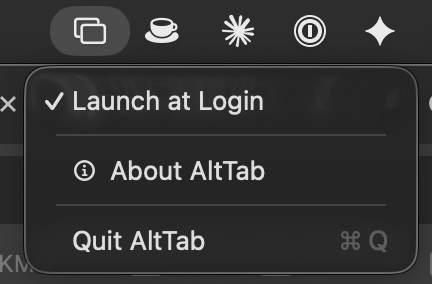

<p align="center">
  
  
  
  
  
  
</p>

# AltTab

**Windows-style window switcher for macOS.**

<!--
  DEMO GIF: record a ~5s screen capture of Option-Tab cycling through window
  thumbnails, save it as Screenshots/demo.gif, then replace the  below with:
    
-->
<p align="center">
  
</p>

macOS Cmd-Tab switches between *applications*. AltTab switches between *windows* — just like Alt-Tab on Windows. Hold Option, tap Tab to see every open window as a thumbnail, cycle through them, and release to switch.

## Download

**[Download the latest AltTab.dmg →](https://github.com/sergio-farfan/alttab-macos/releases/latest)**

Open the `.dmg`, drag **AltTab** to **Applications**, and launch it. Grant **Accessibility** when prompted (System Settings → Privacy & Security → Accessibility).

<!-- UNSIGNED-NOTE: remove this block once notarized builds ship. -->
> This build is not yet notarized. On first launch, right-click **AltTab.app → Open**, or run `xattr -dr com.apple.quarantine /Applications/AltTab.app`.

**Homebrew** *(coming soon)*:

```bash
brew install --cask sergio-farfan/tap/alttab
```

Prefer to build it yourself? See [Build from source](#build-from-source).

## Why another AltTab?

[`lwouis/alttab`](https://github.com/lwouis/alttab) is the feature-rich, highly configurable incumbent. This project is the deliberately minimal alternative:

- **Tiny and auditable** — ~2,000 lines of pure Swift + AppKit, single purpose.
- **Zero dependencies** — no packages, no frameworks bundled.
- **No Screen Recording permission** — titles via the Accessibility API, app icons instead of live thumbnails (avoids the recurring macOS 15 recording prompt). Live window previews are available as a strictly opt-in toggle on macOS 14+.
- **Windows-style Option-Tab** semantics with menu-bar-only footprint (no Dock icon).

If you want extensive customization, use lwouis/alttab. If you want something small you can read end to end, use this.

## Features

- **Option-Tab** to activate, cycle with Tab, confirm on release
- **Shift-Tab** / Arrow keys to navigate in reverse
- **Escape** to cancel without switching
- **Instant response** — window-raise runs off the main thread and app icons are cached, so the switcher appears immediately
- Window titles via Accessibility API — works for all apps without Screen Recording permission
- App icon display with graceful fallback (no Screen Recording prompt on macOS 15+)
- Includes minimized windows, ⌘H-hidden apps, and windows on other Spaces
- Optional live window previews (ScreenCaptureKit, macOS 14+, opt-in from the menu)
- Multi-monitor aware — the switcher opens on the screen with the mouse pointer
- MRU (most recently used) ordering with intra-app focus tracking
- Menu bar utility — no Dock icon, no clutter
- Launch at Login support (macOS 13+ SMAppService)
- Zero dependencies — pure Swift + AppKit
- ~2,000 lines of code, single-purpose, auditable

## Build from source

```bash
git clone https://github.com/sergio-farfan/alttab-macos.git
cd alttab-macos
./build.sh install
open ~/Applications/AltTab.app
```

Then grant **Accessibility** permission when prompted (System Settings → Privacy & Security → Accessibility).

## Prerequisites

| Requirement | Details |
|-------------|---------|
| **macOS** | 13.0+ (Ventura, Sonoma, Sequoia) |
| **Xcode** | Full install from App Store (not just Command Line Tools) |

<details>
<summary>First time with Xcode?</summary>

If you just installed Xcode, you may need to run:

```bash
sudo xcode-select -s /Applications/Xcode.app/Contents/Developer
sudo xcodebuild -license accept
sudo xcodebuild -runFirstLaunch
```
</details>

## Install

### User install (recommended)

Installs to `~/Applications` — no sudo required.

```bash
./build.sh install
```

### System-wide install

Installs to `/Applications` — requires sudo.

```bash
sudo ./build.sh install --system
```

### Build commands

| Command | Description |
|---------|-------------|
| `./build.sh build` | Build only (Release configuration) |
| `./build.sh install` | Build and install to `~/Applications` |
| `./build.sh install --system` | Build and install to `/Applications` (sudo) |
| `./build.sh run` | Build and launch from build directory |
| `./build.sh clean` | Remove build artifacts |
| `./build.sh uninstall` | Remove from `~/Applications` |
| `./build.sh uninstall --system` | Remove from `/Applications` (sudo) |

## Permissions

On first launch, AltTab will prompt for Accessibility access. Screen Recording is optional.

| Permission | Required | Why |
|-----------|----------|-----|
| **Accessibility** | Yes | CGEvent tap for global hotkey detection; AXUIElement for window titles, window management, focus tracking, and unminimize |
| **Screen Recording** | No (opt-in) | Only for the optional "Show Window Previews" feature (macOS 14+, ScreenCaptureKit) |

Grant in: **System Settings → Privacy & Security → Accessibility**

> **Note:** Screen Recording permission is **not required**. Window titles are read via the Accessibility API, and app icons are used instead of live thumbnails. This avoids the repeated "Screen & System Audio Recording" prompt on macOS 15 (Sequoia). Enabling **Show Window Previews** in the status menu is the only thing that requests Screen Recording; with the toggle off (the default) the API is never touched.

## Usage

| Shortcut | Action |
|----------|--------|
| <kbd>Option</kbd> + <kbd>Tab</kbd> | Open switcher, select next window |
| <kbd>Tab</kbd> | Cycle forward (while holding Option) |
| <kbd>Shift</kbd> + <kbd>Tab</kbd> | Cycle backward |
| <kbd>←</kbd> <kbd>→</kbd> | Navigate left / right |
| Release <kbd>Option</kbd> | Switch to selected window |
| <kbd>Escape</kbd> | Cancel, dismiss switcher |
| <kbd>Enter</kbd> | Confirm selection |
| Click thumbnail | Select and switch |

## How It Works

AltTab installs a **CGEvent tap** at the session level to intercept keyboard events globally. A 3-state machine (idle → active → idle) tracks Option hold/release and Tab presses. The event tap includes retry logic with exponential backoff to handle the case where the Accessibility subsystem isn't ready at login time. Window enumeration combines `CGWindowListCopyWindowInfo` (on-screen windows) with `AXUIElement` queries (minimized windows). Window titles are read via `AXUIElement` (`kAXTitleAttribute`), which only requires Accessibility permission — no Screen Recording needed. MRU order is maintained via `NSWorkspace` activation notifications and per-app `AXObserver` callbacks that track focused-window changes — including intra-app switches like Cmd-\`.

The switcher UI is a **non-activating NSPanel** (`.nonactivatingPanel` style mask) so it floats above all windows without stealing focus. App icons are displayed for each window, served from an in-memory cache (prewarmed at launch) so the panel paints immediately instead of resolving each icon through LaunchServices on the fly. Window activation uses `AXUIElement` to raise the specific window and unminimize if needed; that synchronous AX IPC runs on a background queue with a bounded messaging timeout, so a slow target app can't block the main thread (and stall the switcher).

## Architecture

```
AltTab/AltTab/
├── main.swift                  # App entry point — wires NSApp delegate manually
├── AppDelegate.swift           # Lifecycle, menu bar status item, orchestration, session epochs
├── HotkeyManager.swift         # CGEvent tap plumbing; decodes events for the state machine
├── SwitcherStateMachine.swift  # Pure Option-Tab session state machine (unit-tested)
├── WindowModel.swift           # CGWindowList + single AX pass per app, cache + async refresh
├── MRUOrder.swift              # Pure MRU ordering (unit-tested)
├── WindowCapture.swift         # Opt-in ScreenCaptureKit window previews (macOS 14+)
├── SwitcherPanel.swift         # NSPanel overlay with NSVisualEffectView backdrop
├── ThumbnailView.swift         # Individual window cell (preview/icon + title + app name)
├── WindowActivator.swift       # AXUIElement window raise / unminimize (off-main, bounded timeout)
├── PermissionManager.swift     # Accessibility polling; Screen Recording preflight/request
└── PreferencesMenu.swift       # Status bar menu (Launch at Login, Window Previews, Quit)
```

## Uninstall

```bash
./build.sh uninstall                # Remove from ~/Applications
sudo ./build.sh uninstall --system  # Remove from /Applications
```

Or manually delete `AltTab.app` and remove from Login Items in System Settings.

## Contributing

1. Fork the repo
2. Create a feature branch (`git checkout -b feature/my-feature`)
3. Make your changes
4. Test: `./build.sh run`
5. Commit and push
6. Open a Pull Request

## License

[MIT](LICENSE) — Sergio Farfan (sergio.farfan@gmail.com)
